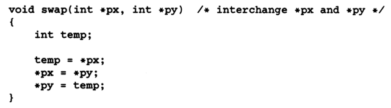
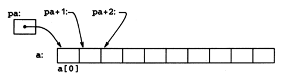
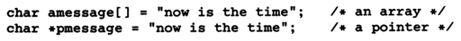
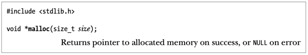
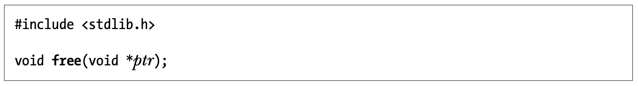
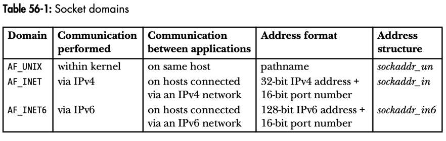

# GIOS Prep

<!-- TOC -->
* [GIOS Prep](#gios-prep)
  * [Pointers and Arrays](#pointers-and-arrays)
    * [Pointers and Function Arguments](#pointers-and-function-arguments)
    * [Pointers and Arrays](#pointers-and-arrays-1)
    * [Address Arithmetic](#address-arithmetic)
    * [Character Pointer and Functions](#character-pointer-and-functions)
    * [Pointer Arrays, Pointers to Pointers](#pointer-arrays-pointers-to-pointers)
    * [Multi-dimensional Array](#multi-dimensional-array)
    * [Pointers vs. Multi-dimensional Arrays](#pointers-vs-multi-dimensional-arrays)
    * [Command-line Arguments](#command-line-arguments)
    * [Pointers to Functions](#pointers-to-functions)
  * [References](#references)
<!-- TOC -->

## Pointers and Arrays

### Pointers and Function Arguments



* Proper function call: `swap(&a, &b);` 
  * `&` is the address-of operator.
  * `px` points to the address of `a`.

### Pointers and Arrays



* By definition, the value or type or expression of type array is the address of element zero of the array: `pa = &a
  [0];`.
* Since the name of the array is a synonym of the location of the first element, the assignment `pa = &a[0];` can 
  also be written as: `pa = a;`.
* `a[i]` can also be written as `*(a + i)` (C converts the former into the latter).
* `&a[i]` can also be written as `a + i` (this equivalence is found after using `&` on both parts of the previous 
  equivalence).
* If `pa` is a pointer, expressions may use it with a subscript (`pa[i]` is identical to `*(pa + i)`).
* Must keep in mind:
  * A pointer is a variable, so `pa=a` and `pa++` are legal.
  * An array is not a variable, so `a=pa` and `a++` are illegal. 
* `f(&a[2])` or `f(a + 2)`: Passing a pointer to the beginning of the subarray.
  * The parameter of function `f` can be declared in any of the following ways: 
    * `f(int arr[]) {...}`
    * `f(int *arr) {...}` (preferred because it says the parameter is a pointer)

### Address Arithmetic
* A pointer and an integer may be added or subtracted:
  * `p++;`
  * `p+=i;` (i is an **int**)
* Pointers may be compared under certain circumstances:
  * If pointers `p` and `q` point to members of the same array, then relations like =, !=, <, >=, etc., work properly.
* _The valid pointer operations are assignment of pointers of the same type, adding or subtracting a pointer and an 
  integer, subtracting or comparing two pointers to members of the same array, and assigning or comparing to zero. 
  All other pointer arithmetic is illegal._
* A pointer of one type cannot be assigned to a pointer of another type unless the pointer on the right-hand side of 
  the assignment is `void *`.

### Character Pointer and Functions



* `amessage` is an array, just big enough to hold the sequence of characters and '\0' that initializes it. 
  Individual characters within the array may be changed but `amessage` will always refer to the same storage.
* `pmessage` is a pointer, initialized ot point ot a string constant; the pointer may subsequently be modified to 
  point elsewhere, but the result is undefined if you try to modify the string contents.
* `*p++`: Postfix-increment `p`, then dereference the resulting `p`.
* `*--p`: Prefix-decrement `p`, then dereference the resulting `p`

### Pointer Arrays, Pointers to Pointers

* `char *lineptr [MAXLINES];`:  Declares an array of pointers to characters with a maximum size of MAXLINES.

### Multi-dimensional Array

* _In general, only the first dimension (subscript) of an array is free; All the others have to be specified._

### Pointers vs. Multi-dimensional Arrays

```c
int a[10][20];
int *b[10];
```

* `a` is a true two-dimensional array.
* `b`'s definition only allocates 10 pointers and does not initialize them (statically or dynamically).
  * The important advantage of the pointer array is that the rows of the array may be of different lengths.

### Command-line Arguments

* `(*++argv)[0]` is the first character of a string in the argument vector.
* `(*++argv)[0]` is equivalent to `**++argv`.

### Pointers to Functions

* Use `void *` in a function pointer to allow processing of any data type. Any pointer can be cast to `void *` and 
  back again without any loss of information.

## Memory Allocation

### Allocating Memory on the Heap: _malloc()_ and _free()_



* Because _malloc()_ returns _void *_, we can assign it to any type of C pointer.
* If memory cannot be allocated, _malloc()_ will return an error. All calls to _malloc()_ should check for this
 error return.



* The _free()_ function deallocates the block of memory pointed to by its _ptr_ argument, which should be an address 
  previously returned by _malloc()_.
  * If _ptr_ is NULL, then _free()_ does nothing.
  * Making any use of _ptr_ after the call to _free()_ is an error that can lead unpredictable results.

Avoid these types of errors:
  * After we allocate a block of memory, we should be careful not to touch any bytes outside the range of that block.
  * It is an error to free the same piece of allocated memory more than once.
  * Never call _free()_ with a pointer that was not obtained by a call to one of the functions in the malloc package.
  * Deallocate any memory after we have finished using it.

## Sockets: Introduction



## References

* The C Programming Language (Kernighan and Ritchie)